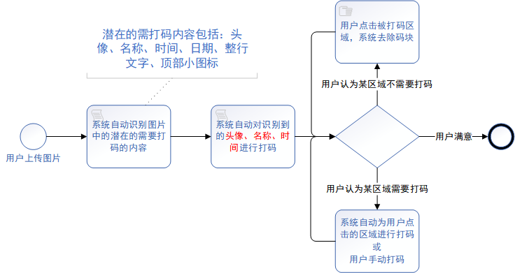

# AndroidDAMA
a smart privacy coding Android application powered by AI

## 🎇RoadMap
### Basic idea
- [ ] build a detection model that can detect all latent privacy content
- [ ] deploy the detection model on web (based on Gradio framework) to test model effects on internal user groups
- [ ] develop the Android application and release the first version to the public
- [ ] improve the app's func occording to the feedbacks
- [ ] embedding multimodal LLM in the APP so that users can use voice or text to command the system to automatically mask the private content
### A More Grand ideal
- [ ] directly using SAM (segment-anything-model, a visual general large model) to make it possible for user to mask anything they want and by any shape according to the shape of the thing needed to be masked
    - [ ] finetune the mobile-sam (a version that can be run on mobile phones) so that it can be easier to detect things that are latently needed to be masked, including avatars, names, times, dates, full lines of tex and small top icons
    - [ ] it's assumed that the app can deal with any type, any scene of images from any apps
## 🚗Work flow 

## Current Work
### Path to Achievement 
- [ ] use light model that can easily run on mobile phones (e.g. mobilevit, mobile-net, shuffle-net) to automatically detect the content to be masked
- [ ] use fast-sam model to assist users mask privacy in a semi-automatic form
- [ ] (further plan) achieve open-Vocabulary object detection on mobile phones

### Things to be figured out
- [x] how to program a mobile phone APP with pyhton [[*solution: use Kivy*](https://zhuanlan.zhihu.com/p/200897880)]
- [ ] how to call gpu on mobile phones (Android & iOS, iPadOS etc.) [[*Reference: Pytorch Android 是如何调用手机gpu加速计算的？*](https://www.zhihu.com/question/404237480/answer/2926029240?utm_id=0)]
